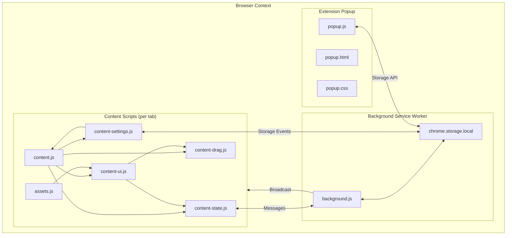
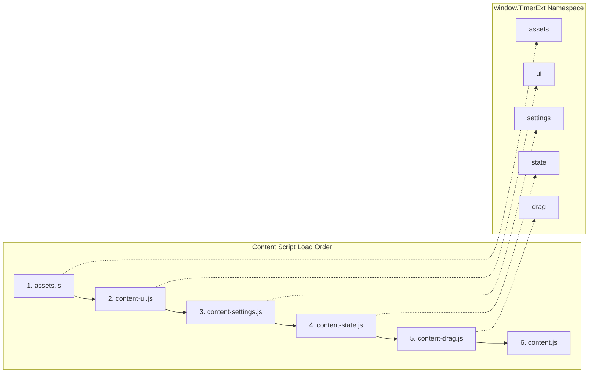
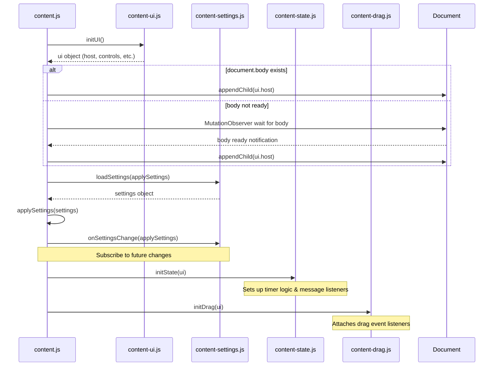
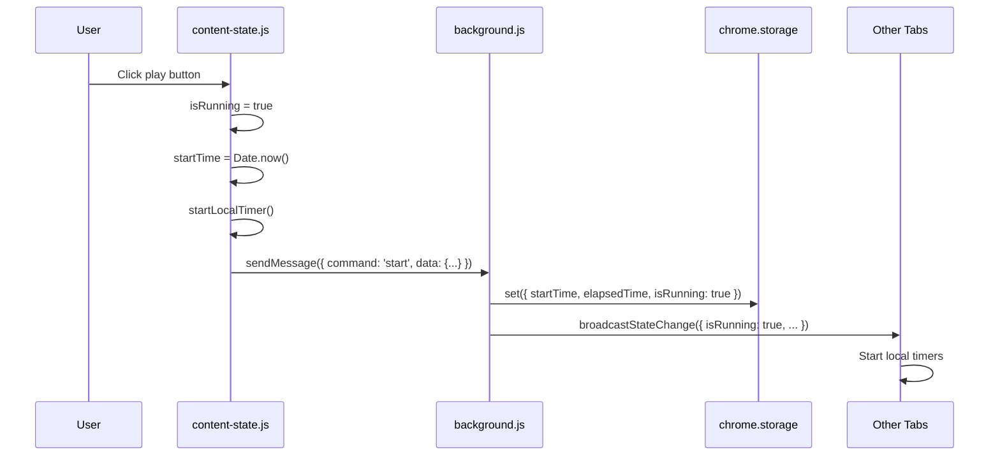
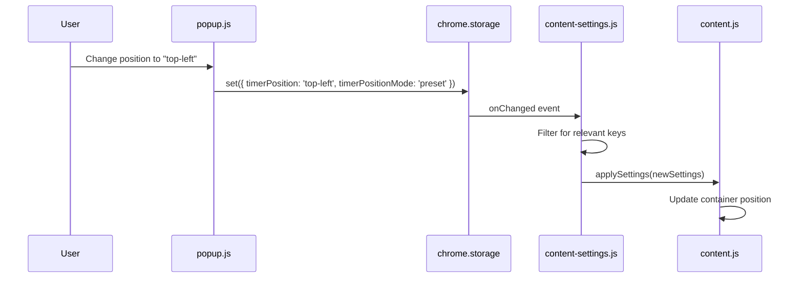

# Timer Chrome Extension - Technical Documentation

> A comprehensive technical guide to the Timer Chrome extension architecture, file structure, features, and implementation details.

---

## Table of Contents

1. [Overview](#overview)
2. [Architecture Diagram](#architecture-diagram)
3. [File Structure](#file-structure)
4. [Core Architecture](#core-architecture)
5. [Module Breakdown](#module-breakdown)
6. [Data Flow](#data-flow)
7. [Chrome APIs Used](#chrome-apis-used)
8. [Features Implementation](#features-implementation)
9. [State Management](#state-management)
10. [UI Components](#ui-components)

---

## Overview

**Timer** is a Manifest V3 Chrome extension that displays a persistent, configurable timer on every webpage. The extension features:

- **Dual Modes**: Stopwatch (count up) and Timer (countdown)
- **Cross-Tab Synchronization**: State persists and syncs across all open tabs
- **Drag & Drop Positioning**: Custom position support with persistence
- **Shadow DOM Isolation**: CSS encapsulation prevents conflicts with host pages
- **Collapsible UI**: Minimalist design that can be collapsed to an icon

| Property | Value |
|----------|-------|
| Manifest Version | 3 |
| Extension Version | 2.1 |
| Required Permissions | `storage` |
| Content Script Injection | All URLs |

---

## Architecture Diagram



---

## File Structure

```
timer-chrome-extension/
├── manifest.json          # Extension configuration
├── background.js          # Service worker (state coordination)
├── content.js             # Bootstrap script (entry point)
├── content-ui.js          # UI module (Shadow DOM, controls)
├── content-settings.js    # Settings module (load/listen)
├── content-state.js       # State module (timer logic, sync)
├── content-drag.js        # Drag module (positioning)
├── assets.js              # Centralized SVGs and CSS
├── popup.html             # Settings popup structure
├── popup.js               # Popup logic
├── popup.css              # Popup styles
├── styles.css             # Timer widget styles (reference)
├── icon.svg               # Source icon
├── t2.png                 # Extension icon (all sizes)
├── t.jpeg, t.png, timer2.png  # Additional assets
├── README.md              # User-facing documentation
└── LICENSE                # MIT + Commercial restriction
```

### File Dependencies



---

## Core Architecture

### Namespace Pattern

All content script modules share a global namespace `window.TimerExt` to avoid pollution and enable inter-module communication:

```javascript
(function () {
    const ns = (window.TimerExt = window.TimerExt || {});
    
    // Module code here
    
    ns.moduleName = { /* exports */ };
})();
```

### Load Order (defined in manifest.json)

| Order | File | Purpose |
|-------|------|---------|
| 1 | `assets.js` | Provides SVG icons and inline CSS |
| 2 | `content-ui.js` | Builds Shadow DOM and UI controls |
| 3 | `content-settings.js` | Manages settings loading/watching |
| 4 | `content-state.js` | Handles runtime state and timer logic |
| 5 | `content-drag.js` | Implements drag-and-drop positioning |
| 6 | `content.js` | Bootstrap - initializes all modules |

---

## Module Breakdown

### 1. `manifest.json` - Extension Configuration

Defines the extension's core properties and capabilities.

```json
{
  "manifest_version": 3,
  "name": "Timer",
  "version": "2.1",
  "permissions": ["storage"],
  "background": { "service_worker": "background.js" },
  "content_scripts": [{ "matches": ["<all_urls>"], "js": [...] }],
  "action": { "default_popup": "popup.html" }
}
```

**Key Configurations:**
- `manifest_version: 3` - Uses latest Manifest V3 APIs
- `permissions: ["storage"]` - Only permission needed for persistence
- `content_scripts` - Injected on all URLs in specific order
- `action` - Toolbar button opens settings popup

---

### 2. `background.js` - Service Worker

The background service worker acts as a **central coordinator** for timer state across all tabs.

#### Responsibilities:
1. **Persist State** - Saves timer state to `chrome.storage.local`
2. **Broadcast Changes** - Notifies all tabs when state changes
3. **Initialize State** - Sets defaults on first install

#### Message Commands:

| Command | Direction | Description |
|---------|-----------|-------------|
| `start` | Tab → Background | Start timer, save state, broadcast |
| `stop` | Tab → Background | Stop timer, save elapsed time, broadcast |
| `reset` | Tab → Background | Reset timer to zero, broadcast |
| `getStatus` | Tab → Background | Request current state (async response) |
| `stateChanged` | Background → Tabs | Broadcast state update to all tabs |

#### Initial State (on install):

```javascript
{
  elapsedTime: 0,
  isRunning: false,
  startTime: 0,
  isTimerCollapsed: false,
  mode: 'stopwatch',
  currentTimerTarget: 0,
  timerHours: 0,
  timerMinutes: 0,
  timerSeconds: 0
}
```

---

### 3. `assets.js` - Centralized Assets

Provides all SVG icons and inline CSS as a single source of truth.

#### SVG Icons:

| Key | Icon | Usage |
|-----|------|-------|
| `back` | ◀ Arrow | Collapse button |
| `play` | ▶ Play | Start timer |
| `pause` | ⏸ Pause | Pause timer |
| `reset` | ↻ Refresh | Reset timer |
| `timer` | ⏱ Clock | Collapsed state icon |

#### Inline CSS:
- Complete styles for the timer widget
- Injected into Shadow DOM for isolation
- Includes animations, hover states, and responsive rules

---

### 4. `content-ui.js` - UI Module

Builds the timer widget using **Shadow DOM** for style isolation.

#### Exports:
```javascript
ns.ui = { initUI }
```

#### `initUI()` Returns:

```javascript
{
  host,           // Shadow DOM host element
  shadow,         // Shadow root
  container,      // Main timer container (#persistent-timer-container)
  controls: {
    collapseButton,    // Collapse/expand button
    playPauseButton,   // Play/pause toggle
    resetButton        // Reset button
  },
  elements: {
    timeDisplay,  // Time text element (00:00:00)
    playIcon,     // Play icon wrapper
    pauseIcon     // Pause icon wrapper
  },
  svgs,           // Reference to icon SVGs
  formatTime,     // Time formatting helper
  formatTimerTime,
  formatStopwatchTime,
  setRunningIcons // Toggle play/pause icon visibility
}
```

#### Shadow DOM Structure:

```html
<div id="timer-shadow-host" data-timer-host="true">
  #shadow-root (open)
    <style>/* Inline CSS from assets.js */</style>
    <div id="persistent-timer-container">
      <button id="collapse-btn" class="control-button">
        <div class="icon-wrapper"><!-- back/timer SVG --></div>
      </button>
      <div class="play-timer-group">
        <button id="play-pause-btn" class="control-button">
          <div id="play-icon-wrapper" class="icon-wrapper"><!-- play SVG --></div>
          <div id="pause-icon-wrapper" class="icon-wrapper hidden"><!-- pause SVG --></div>
        </button>
        <div class="time-display">00:00:00</div>
      </div>
      <button id="reset-btn" class="control-button">
        <div class="icon-wrapper"><!-- reset SVG --></div>
      </button>
    </div>
</div>
```

---

### 5. `content-settings.js` - Settings Module

Manages loading and watching for settings changes.

#### Exports:
```javascript
ns.settings = { defaults, loadSettings, onSettingsChange }
```

#### Default Settings:

```javascript
{
  isTimerVisible: true,
  timerPosition: 'top-right',        // 'top-left', 'top-right', 'bottom-left', 'bottom-right'
  timerPositionMode: 'preset',       // 'preset' or 'custom'
  timerCustomPosition: { left: 8, top: 8 },
  isTimerCollapsed: false,
  mode: 'stopwatch',                 // 'stopwatch' or 'timer'
  timerHours: 0,
  timerMinutes: 0,
  timerSeconds: 0,
  currentTimerTarget: 0              // Total ms for countdown
}
```

#### Functions:

| Function | Description |
|----------|-------------|
| `loadSettings(callback)` | Load settings from storage, apply defaults |
| `onSettingsChange(handler)` | Subscribe to settings changes (filters runtime keys) |

---

### 6. `content-state.js` - State Module

Handles all runtime timer logic and synchronization with background.

#### Exports:
```javascript
ns.state = { initState }
```

#### Internal State Variables:

```javascript
let isRunning = false;
let isCollapsed = false;
let startTime = 0;        // Timestamp when timer started
let elapsedTime = 0;      // Accumulated time in ms
let timerInterval = null; // setInterval reference
let mode = 'stopwatch';   // 'stopwatch' or 'timer'
let currentTimerTarget = 0; // Target time for countdown
```

#### Core Functions:

| Function | Description |
|----------|-------------|
| `tick()` | Updates display every second (handles both modes) |
| `startLocalTimer()` | Starts interval for local time updates |
| `stopLocalTimer()` | Clears interval |
| `updateUI()` | Syncs UI with current state |
| `toggleRun()` | Toggles play/pause state |
| `reset()` | Resets timer to initial state |
| `setCollapsed(bool)` | Toggles collapsed state |

#### Timer Modes:

**Stopwatch Mode:**
```javascript
// Counts UP from 0
const currentTotal = elapsedTime + (Date.now() - startTime);
```

**Timer Mode (Countdown):**
```javascript
// Counts DOWN from target
const elapsed = Date.now() - startTime;
const remaining = Math.max(0, currentTimerTarget - elapsed);
// Auto-stops when remaining === 0
```

---

### 7. `content-drag.js` - Drag Module

Implements mouse-based drag-and-drop positioning.

#### Exports:
```javascript
ns.drag = { initDrag }
```

#### Implementation Details:

1. **Mouse Down** - Captures offset, sets up listeners
2. **Mouse Move** - Updates position with clamping to viewport
3. **Mouse Up** - Saves final position to storage

#### Position Clamping:
```javascript
function clamp(value, min, max) { 
  return Math.max(min, Math.min(max, value)); 
}

const left = clamp(e.clientX - dragOffsetX, 0, 
  Math.max(0, window.innerWidth - container.offsetWidth));
const top = clamp(e.clientY - dragOffsetY, 0, 
  Math.max(0, window.innerHeight - container.offsetHeight));
```

#### Position Persistence:
```javascript
chrome.storage.local.set({
  timerPositionMode: 'custom',
  timerCustomPosition: { left, top }
});
```

---

### 8. `content.js` - Bootstrap Script

The entry point that initializes all modules in the correct order.

#### Initialization Flow:



#### `applySettings()` Function:

Handles both preset and custom positioning:

```javascript
function applySettings(settings) {
  // Visibility
  ui.container.style.display = settings.isTimerVisible ? 'flex' : 'none';
  
  if (mode === 'custom' && settings.timerCustomPosition) {
    // Custom: use exact coordinates
    container.style.left = `${settings.timerCustomPosition.left}px`;
    container.style.top = `${settings.timerCustomPosition.top}px`;
  } else {
    // Preset: apply corner positions
    switch (position) {
      case 'top-left': ...
      case 'top-right': ...
      case 'bottom-left': ...
      case 'bottom-right': ...
    }
  }
  
  // Collapse state
  ui.container.classList.toggle('collapsed', settings.isTimerCollapsed);
}
```

---

### 9. Popup Components

#### `popup.html` - Structure

Provides the settings interface accessible from the toolbar icon.

**Sections:**
1. **Visibility Toggle** - Show/hide timer on page
2. **Mode Selection** - Stopwatch or Timer mode
3. **Timer Settings** - Hours/minutes/seconds inputs (timer mode only)
4. **Position Selection** - Preset corner positions
5. **Footer** - Link to more info

#### `popup.js` - Logic

| Function | Description |
|----------|-------------|
| `loadSettings()` | Load and apply current settings to UI |
| `saveSettings()` | Persist changes to storage |
| `handleModeChange()` | Toggle timer settings visibility |
| `handleSetTimer()` | Validate and save timer target (max 24 hours) |

#### `popup.css` - Styles

- Dark theme matching timer widget
- Modern toggle switch component
- Grid layout for position/mode options
- Responsive input fields

---

## Data Flow

### Timer Start Flow



### Settings Change Flow



---

## Chrome APIs Used

| API | Usage |
|-----|-------|
| `chrome.storage.local.get()` | Load persisted state and settings |
| `chrome.storage.local.set()` | Save state and settings |
| `chrome.storage.onChanged` | Listen for setting updates |
| `chrome.runtime.sendMessage()` | Content script → Background communication |
| `chrome.runtime.onMessage` | Background → Content script communication |
| `chrome.tabs.query()` | Find all tabs for broadcasting |
| `chrome.tabs.sendMessage()` | Send message to specific tab |
| `chrome.runtime.onInstalled` | Initialize state on first install |

---

## Features Implementation

### 1. Cross-Tab Synchronization

**Problem:** Each tab has its own content script instance with independent state.

**Solution:** 
- Background service worker maintains canonical state
- Any state change triggers broadcast to all tabs
- Tabs sync their local state on receiving broadcasts

### 2. Persistence Across Sessions

**Problem:** Timer state should survive browser restart.

**Solution:**
- All state saved to `chrome.storage.local`
- On init, content scripts request current state from background
- Background retrieves from storage and responds

### 3. Shadow DOM Isolation

**Problem:** Timer CSS could conflict with webpage styles.

**Solution:**
- Timer UI lives inside a Shadow DOM
- All styles are injected inline from `assets.js`
- Host element has `style.all = 'initial'` to reset inherited styles

### 4. Drag-and-Drop Positioning

**Problem:** Users need flexible timer placement.

**Solution:**
- Mouse event listeners on shadow host
- `mousemove` updates position in real-time
- `mouseup` saves position as "custom" mode
- Viewport clamping prevents off-screen placement

### 5. Dual Timer Modes

**Problem:** Users need both stopwatch (count up) and timer (countdown).

**Solution:**
- `mode` setting stored in storage
- `content-state.js` handles both modes in `tick()`:
  - Stopwatch: `elapsed + (now - startTime)`
  - Timer: `target - (now - startTime)`
- Timer mode auto-stops when reaching zero

---

## State Management

### Storage Schema

```typescript
interface TimerStorage {
  // Runtime State
  startTime: number;        // Unix timestamp when started
  elapsedTime: number;      // Accumulated time in ms
  isRunning: boolean;       // Whether timer is active
  
  // Settings
  isTimerVisible: boolean;  // Widget visibility
  isTimerCollapsed: boolean; // Collapsed state
  timerPosition: 'top-left' | 'top-right' | 'bottom-left' | 'bottom-right';
  timerPositionMode: 'preset' | 'custom';
  timerCustomPosition: { left: number; top: number };
  
  // Mode Settings
  mode: 'stopwatch' | 'timer';
  timerHours: number;
  timerMinutes: number;
  timerSeconds: number;
  currentTimerTarget: number;  // Total ms for countdown
}
```

### State Separation

| Category | Keys | Changed By | Watched By |
|----------|------|------------|------------|
| Runtime | `startTime`, `elapsedTime`, `isRunning` | Background | State module |
| UI Settings | `isTimerVisible`, `isTimerCollapsed`, position | Popup, Drag | Settings module |
| Mode Settings | `mode`, timer values, `currentTimerTarget` | Popup | Settings module |

---

## UI Components

### Main Timer Widget

```
┌──────────────────────────────────────────┐
│  ◀  │  ▶ │  00:00:00  │  ↻  │           │
│ (1) │ (2)│    (3)     │ (4) │           │
└──────────────────────────────────────────┘

(1) Collapse/Expand Button
(2) Play/Pause Button  
(3) Time Display
(4) Reset Button
```

### Collapsed State

```
┌───────┐
│   ⏱   │
└───────┘
```

### Popup UI

```
┌─────────────────────────────────┐
│       Timer Settings            │
├─────────────────────────────────┤
│ Show Timer on Page    [Toggle]  │
├─────────────────────────────────┤
│ Mode                            │
│  ○ Stopwatch  ○ Timer          │
├─────────────────────────────────┤
│ Timer Settings (if timer mode)  │
│  [HH] : [MM] : [SS]            │
│        [Set Timer]              │
├─────────────────────────────────┤
│ Position                        │
│  ○ Top Left    ○ Top Right     │
│  ○ Bottom Left ○ Bottom Right  │
├─────────────────────────────────┤
│ Tip: Drag timer for custom pos  │
│        More Info & Updates      │
└─────────────────────────────────┘
```

---

## Accessibility

The extension implements several accessibility features:

- **ARIA Labels**: All buttons have `aria-label` attributes
- **Keyboard Navigation**: Buttons support Enter/Space activation
- **Focus Indicators**: `:focus-visible` styling for keyboard users
- **Reduced Motion**: Respects `prefers-reduced-motion` media query
- **Screen Reader Support**: SVGs have `aria-hidden="true"`

---

## Performance Considerations

1. **Minimal Permissions**: Only `storage` permission required
2. **Efficient Updates**: 1-second interval (not RAF) for timer updates
3. **Event Delegation**: Single listener on host for drag events
4. **Lazy Body Mount**: Uses MutationObserver if body not ready
5. **Selective Redraws**: Only updates changed UI elements

---

## Browser Compatibility

- **Chrome 88+**: Requires Manifest V3 support
- **Edge 88+**: Chromium-based, full compatibility
- **Opera 75+**: Chromium-based, full compatibility
- **Firefox**: Not compatible (Manifest V3 differences)

---

## Development Notes

### Adding New Features

1. **New Setting**: Add to `defaults` in `content-settings.js`
2. **New UI Element**: Add to `initUI()` in `content-ui.js`
3. **New State Logic**: Add to `initState()` in `content-state.js`
4. **New Message Type**: Handle in `background.js` switch statement

### Debugging Tips

- Enable commented `console.log` statements in source files
- Use Chrome DevTools → Application → Storage to inspect state
- Check service worker console via `chrome://extensions` → "Service Worker"

---

*Documentation generated for Timer Chrome Extension v2.1*
